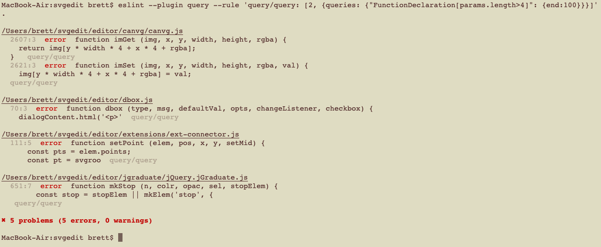

[](https://www.npmjs.com/package/eslint-plugin-query)
[](https://david-dm.org/brettz9/eslint-plugin-query)
[](https://david-dm.org/brettz9/eslint-plugin-query?type=dev)

[](badges/tests-badge.svg)
[](badges/coverage-badge.svg)

[](https://snyk.io/test/github/brettz9/eslint-plugin-query)

[](badges/licenses-badge.svg)

[](badges/licenses-badge-dev.svg)

<!--[](LICENSE-MIT) -->

[](https://issuehunt.io/r/brettz9/eslint-plugin-query)

# eslint-plugin-query

Add "rules" made of arbitrary [selectors](https://eslint.org/docs/developer-guide/selectors) to choose source lines to be reported.

## Installation

If using as a plugin, you can install locally:

```sh
$ npm i eslint-plugin-query --save-dev
```

However, if you only wish to use this tool to make one-off searches of code,
the global installation is recommended as it is more convenient for CLI usage
and does not require each project to have its own installation.

You can install globally as follows using the `-g` flag:

```sh
$ npm i -g eslint-plugin-query
```

## Usage

Add `query` to the plugins section of your `eslint.config.js` configuration file:

```js
import query from 'eslint-plugin-query';

export default {
  plugins: {
    query
  }
};
```


Then configure the rules you want to use under the rules section.

```js
export default {
  // ...
  rules: {
    'query/query': [2, {
      queries: {
        'FunctionDeclaration[params.length>4]': {
          // All optional
          // Defaults to just `${result}`
          template: 'Oops, too long: `${result}`.',
          // Default: 0 (also accepts negative)
          start: 0,
          // Default Infinity (also accepts negative)
          end: 100
        }
      }
    }],
    'query/no-missing-syntax': [
      'error',
      {
        queries: {
          'FunctionDeclaration[params.length<2]': {
            message: 'Must have at least two short function signatures!',
            minimum: 2
          }
        }
      }
    ]
  }
};
```

## Supported Rules

* [query/no-missing-syntax](./docs/rules/no-missing-syntax.md)
* [query/query](./docs/rules/query.md)

## CLI

It is simpler to use the CLI to get at results (though you'll want to
install `eslint-plugin-query` in such a case):


Note that the CLI uses the ESLint formatter, in this case showing them as
errors, but as this does no fixing, you can use the `esq` CLI command simply
to see the code (as in the above screenshot).

Note also that in the CLI (and also programmatic) usage, we auto-detect your
parser and parser options. However, since we allow you to supply file globs,
and since ESLint allows `overrides` such that you may have different parsers
set up in your config, we don't know by default which file to check for the
parser config. To ensure the proper parser is used, you can either use the
`notGlob` setting (and use a regular file) or rely on setting an override for
the default `eslint-plugin-query-dummy.js` file (you don't need to have this
file in your project, but it allows you to specify an `overrides` `file`
targeting it and giving a parser or parser options for it).


## Tips

### Queries into badges

You might use the likes of [eslint-formatter-badger](https://github.com/brettz9/eslint-formatter-badger)
to build a badge counting the use of certain JavaScript features out of
your results, e.g., if you wanted to show the number of
`FunctionDeclaration`'s in your project.

Unless you wish to count the aggregate of total of multiple selectors, you'd
probably need to create separate badges for each type (since the
`eslint-formatter-badger` determines type by the whole rule (e.g., from the
rule's `meta.type`) rather than by the rule options (in this case `queries`)
that are in use). Such an approach would allow you to get the individual
count for each query type.

You could then display these badges adjacently, optionally with different
colors, and with human-readable text (e.g., "Function declarations")),
possibly with a plain intro badge before them (e.g., "Language Feature
Counts").

### One-off searches

Though it is probably just easier to use the CLI, it may be of interest
to know that you can use the ESLint binary to make one-off searches,
e.g., if you have installed `eslint` and this plugin globally:

```shell
eslint --plugin query --rule 'query/query: [2, {queries: {"FunctionDeclaration[params.length>4]": {end:100}}}]' .
```

Or if you only have `eslint` and this plugin as local installs:

```shell
$(npm bin)/eslint --plugin query --rule 'query/query: [2, {queries: {"FunctionDeclaration[params.length>4]": {end:100}}}]' .
```

Here are the results:



Note that you can add the `--no-save` flag (for local or global use) if
you only want to use this plugin for querying in this manner, and not as
the basis of permanent rules.

Another use case is ensuring a file or set of files (e.g., within `overrides`)
(or targeted via glob if on the command line) only has one type or a set of
types (by using the `:not()` esquery selector):

```shell
$(npm bin)/eslint --plugin query --rule 'query/query: [2, {queries: {":not(FunctionDeclaration,FunctionExpression)": {end:100}}}]' .
```

## To-dos

1. Could give `fixable` option (to remove all identified nodes)
1. Add an option to match (additionally) by regex.
1. Add an option to highlight certain esqueries out of the results, e.g.,
    to show the list of parameter names of all functions
1. Get an AST parser for jsdoc comment blocks, e.g., to search for `@todo` comments,
    or all functions with a given (jsdoc-described) signature (e.g., all params
    accepting a given type, all typedefs extending a type, all `@public` functions,
    etc. If selectors don't support `parent`, would be ideal to add support,
    e.g., to query for parent comment of a given function signature.
1. Add separate rule for to-do specific querying (date, etc.)
    see <https://github.com/gajus/eslint-plugin-jsdoc/issues/299>,
    <https://github.com/sindresorhus/eslint-plugin-unicorn/issues/238>,
    and <https://github.com/eslint/eslint/issues/11747>.
    1. Would ideally allow sorting (see <https://eslint.org/docs/developer-guide/working-with-custom-formatters#using-rule-metadata>?)
        1. Note: Could implement with new formatter, and the formatter
            could be used for other purposes as well (e.g., showing rule
            errors by `meta.type` or in this case, by query)
    1. Also lint to ensure even unexpired to-dos have an actual date
        format (see Unicorn to-do rule). Could use
        `jsdoc/match-description` if Unicorn isn't supporting (and option
        to it to show text of description so can be used in queries, also
        for other rules like `jsdoc/no-undefined-types`?).
1. Might add separate rule using jsdoc blocks in place of selectors, e.g., to
    find all Date objects, use `/** @type {Date} */`. Likewise with
    TypeScript expressions (again, not as much for validation, which TS
    already does, but for querying documents using TS).
    1. Could make selector which allows such matching, e.g.,
        `:matches('jsdoc', '@param {string}\n@param {Date}')` or
        `:matches('typescript', '(...args: string[]) => void')`
    1. In supporting this, could make utility for compiling jsdoc (or (a
        subset of) TS) into selectors (and vice versa). Use
        `comment-parser`. Could also convert jsdoc to TS by stripping
        out types and putting inline (as an `eslint-plugin-jsdoc` rule)
        or in reverse.
1. Make combining selectors, e.g., "string" to find string literals or
    string literals joined in a binary expression, etc. Then can search
    for a `ReturnStatement` with `string` to get the return type.
1. Allow dir/file glob at beginning of selector, e.g., `docs/** IfStatement`
1. Could use [`es-file-traverse`](https://github.com/brettz9/es-file-traverse)
    to limit queries to those that are visited by imports (including with
    "Other interesting use cases" below).
1. Add separate rules (all supporting range queries) for semver-aware
    `@since` or `@version`, integer-aware `@variation`, (and date-aware
    abilities for tags indicated in options (e.g., if one defined `@date`).
    Also useful for `@license` and `@copyright` searching
1. Other interesting use cases for selectors (independent of this plugin):
    1. A selector syntax for defining JS syntax highlighters (e.g.,
        `FunctionDeclaration {color: green;}`)
    1. Potentially less brittle monkey-patching
    1. Dynamically evaluating snippets, even private, from within other
        trusted files (e.g., user templates).
    1. Making links within jsdoc documentation to specific parts of code
    1. Embedding code snippets within Markdown documentation without
        duplication (e.g., querying for all public method names to
        generate documentation headings or embed example code).
    1. Using a JS XSLT equivalent to reshape an entire JS file into HTML
    1. Searching for code within an IDE (within or across files)
    1. Create badges showing summary of number of functions, classes, et.
        along with number of lines of code
